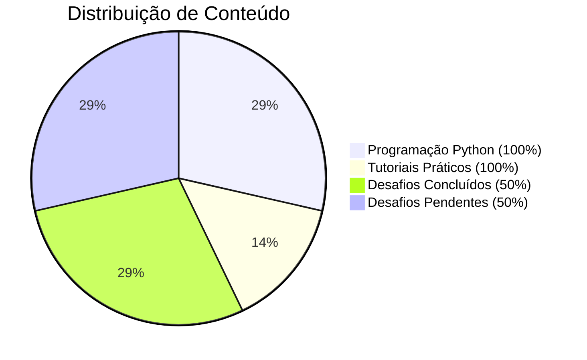

# Trilha Santander Open Academy Cibersegurança 2025 em parceria com a **[DIO](https://github.com/digitalinnovationone)**

Repositório com os desafios, tutorias e testes práticos realizados no bootcamp **Santander Cibersegurança 2025** em parceria com a **[DIO](https://github.com/digitalinnovationone)**.

## 🎓 Propósito

Este repositório documenta minha jornada na formação do Bootcamp Santander Open Academy Cibersegurança 2025 em parceria com a DIO, servindo como:

| Função | Descrição |
|--------|-----------|
| **📚 Acervo** | Competências em segurança ofensiva e defensiva |
| **📈 Histórico** | Evolução nos conceitos e ferramentas |
| **💡 Divulgação** | Observações e descobertas técnicas |

## 🚀 Conteúdo do Repositório

| Categoria | Projeto | Status | Descrição |
|-----------|---------|---------|-----------|
| **🐍 Programação** | [Funções em Python](https://github.com/ThiagoMaria-SecurityIT/Bootcamp_DIO_e_Santander-Ciberseguran-a_2025/tree/main/Entendendo%20def%20e%20return%20em%20Python) | 🟢 FINALIZADO | Entendendo def e return em Python |
| **🐍 Programação** | [Loops em Python vs C](https://github.com/ThiagoMaria-SecurityIT/Bootcamp_DIO_e_Santander-Ciberseguran-a_2025/tree/main/Loop%20For%3A%20Python%20vs%20C%20-%20Guia%20Simples) | 🟢 FINALIZADO | Loop For: Python vs C - Guia Simples |
| **🛠️ Tutoriais** | [Laboratório Kali Linux](https://github.com/ThiagoMaria-SecurityIT/Bootcamp_DIO_e_Santander-Ciberseguran-a_2025/tree/main/security-training-lab) | 🟢 FINALIZADO | Tutoriais de instalação e configurações da VirtualBox, Kali Linux e Metasplotiable 2 |
| **🔓 Desafio** | [Simulação de Brute Force no DVWA](https://github.com/ThiagoMaria-SecurityIT/Bootcamp_DIO_e_Santander-Ciberseguran-a_2025/tree/main/Desafio_DVWA) | 🟢 FINALIZADO | Simulação de ataque força bruta (nível Low e High) - Desafio concluído com sucesso |
| **🔓 Desafio** | [Simulação de Brute Force em FTP do Metasplotiable 2](https://github.com/ThiagoMaria-SecurityIT/Bootcamp_DIO_e_Santander-Ciberseguran-a_2025/tree/main/Desafio%20de%20For%C3%A7a%20Bruta%20em%20FTP%20do%20Metasploitable%202) | 🟢 FINALIZADO | Simulação concluída com êxito | 
| **🔓 Desafio** | [Simulação de Password Spraying em SMB](https://github.com/ThiagoMaria-SecurityIT/Bootcamp_DIO_e_Santander-Ciberseguran-a_2025/tree/main/Desafio_Metasploitable_2_Password_Spraying) | 🟢 **FINALIZADO** | Simulação concluída com êxito|
| **🔒 Desafio** | Simulando um Malware de Captura de Dados | 🔴 PENDENTE - Prazo: 30/10/2025 | Última atualização: 16/OUT/2025 |

## 📊 Resumo do Progresso

## 🎯 Destaques

### 🔥 Projeto em Destaque
[**Brute Force Attack no DVWA**](https://github.com/ThiagoMaria-SecurityIT/Bootcamp_DIO_e_Santander-Ciberseguran-a_2025/tree/main/Desafio_DVWA)
 
*ataque bem-sucedido no nível IMPOSSIBLE*

### 🛠️ Tutoriais em Destaque
[**Laboratório Kali Linux**](https://github.com/ThiagoMaria-SecurityIT/Bootcamp_DIO_e_Santander-Ciberseguran-a_2025/tree/main/security-training-lab)
 
*configuração completa do ambiente*

## 📈 Sistema de Andamento

| Status | Significado |
|--------|-------------|
| 🟢 **FINALIZADO** | Atividades concluídas e revisadas |
| 🟡 **EM DESENVOLVIMENTO** | Em fase de execução/estudo |
| 🔴 **PENDENTE** | A ser iniciado |

## 🏆 Conquistas

- ✅ **Ambientes Práticos** configurados e testados
- ✅ **Exercícios de Programação** resolvidos
- ✅ **Desafios de Segurança** completados
- ✅ **Tutoriais** criados para auxiliar outros estudantes

---

*Criado durante o Santander Cibersegurança 2025 | DIO*

**🚀 Evolução contínua em Cibersegurança**

## About Me & Contact

**Thiago Maria - From Brazil to the World 🌎**  
*Senior Information Security Professional | Security Risk & Compliance Specialist | AI Security Researcher | Software Developer | Post-Quantum Cryptography Enthusiast*

My passion for programming and my professional background in security analysis led me to create this GitHub account to share my knowledge of security information, cybersecurity, Python, and AI development practices. My work primarily focuses on prioritizing security in organizations while ensuring usability and productivity.

Let's Connect:  

👇🏽 Click on the badges below:  

  
  
 
